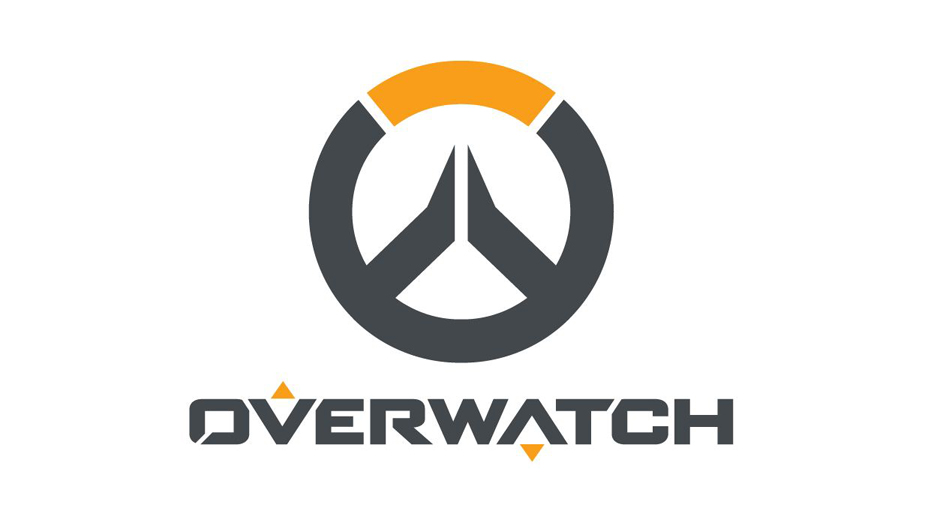

# Overwatch API
An unofficial [Overwatch](https://playoverwatch.com) and [Overwatch League](https://overwatchleague.com) HTTP API and NodeJS module.

<p align=center></img></p>

[](https://www.npmjs.com/package/overwatch-api)
[](https://travis-ci.org/alfg/overwatch-api)

## Features
* Profile Data*
* Career Stats*
* Overwatch League Data
  * Live Match
  * Standings
  * Schedule

**Please note, as of the JUNE 26, 2018 patch, Career Profiles will no longer be public by default (now defaults to Friends Only). An option to make Career Profiles visible has been added under Options > Social > Profile Visibility. 

Your profile *MUST* be public to view most profile and career stats with this API.

Source: https://playoverwatch.com/en-us/news/patch-notes/pc#patch-47946

## API Docs
See: https://owapi.io/docs/

## NPM Module
If you wish to use the Javascript API in your own project, see [api/README.md](api/README.md).

## Demo

```
curl http://owapi.io/profile/pc/us/Jay3-11894
```
```json
{
  "username": "Jay3",
  "level": 2970,
  "portrait": "https://d15f34w2p8l1cc.cloudfront.net/overwatch/190aa6150e33690e39a9c91308d5da9b2e262262657af26579b95e939c44d5ad.png",
  "endorsement": {
    "sportsmanship": {
      "value": 0.18,
      "rate": 18
    },
    "shotcaller": {
      "value": 0.44,
      "rate": 44
    },
    "teammate": {
      "value": 0.38,
      "rate": 38
    },
    "level": null,
    "frame": "https://static.playoverwatch.com/svg/icons/endorsement-frames-3c9292c49d.svg#_2",
    "icon": "data:image/svg+xml;base64,PHN2ZyBoZWlnaHQ9IjQwIiB3aWR0aD0iNDAiIHhtbG5zPSJodHRwOi8vd3d3LnczLm9yZy8yMDAwL3N2ZyIgeG1sbnM6eGxpbms9Imh0dHA6Ly93d3cudzMub3JnLzE5OTkveGxpbmsiPjxjaXJjbGUgcj0iMTUuOTE1NDk0MzA5MTg5NTQiIGZpbGw9IiMyYTJiMmUiIHN0cm9rZS1kYXNoYXJyYXk9IjQ0IDU2IiBzdHJva2UtZGFzaG9mZnNldD0iMjUiIHN0cm9rZS13aWR0aD0iMyIgc3Ryb2tlPSIjZjE5NTEyIiBjeD0iNTAlIiBjeT0iNTAlIj48L2NpcmNsZT48Y2lyY2xlIHI9IjE1LjkxNTQ5NDMwOTE4OTU0IiBmaWxsPSJ0cmFuc3BhcmVudCIgc3Ryb2tlLWRhc2hhcnJheT0iMzggNjIiIHN0cm9rZS1kYXNob2Zmc2V0PSI4MSIgc3Ryb2tlLXdpZHRoPSIzIiBzdHJva2U9IiNjODFhZjUiIGN4PSI1MCUiIGN5PSI1MCUiPjwvY2lyY2xlPjxjaXJjbGUgcj0iMTUuOTE1NDk0MzA5MTg5NTQiIGZpbGw9InRyYW5zcGFyZW50IiBzdHJva2UtZGFzaGFycmF5PSIxOCA4MiIgc3Ryb2tlLWRhc2hvZmZzZXQ9IjQzIiBzdHJva2Utd2lkdGg9IjMiIHN0cm9rZT0iIzQwY2U0NCIgY3g9IjUwJSIgY3k9IjUwJSI+PC9jaXJjbGU+PHRleHQgeD0iNTAlIiB5PSI1MCUiIGR5PSIuM2VtIiBmb250LWZhbWlseT0iY2VudHVyeSBnb3RoaWMsYXJpYWwsc2Fucy1zZXJpZiIgZm9udC13ZWlnaHQ9IjMwMCIgZm9udC1zaXplPSIxNiIgc3Ryb2tlPSIjZjZmNmY2IiBzdHJva2Utd2lkdGg9IjEiIGZpbGw9IiNmNmY2ZjYiIHRleHQtYW5jaG9yPSJtaWRkbGUiPk5hTjwvdGV4dD48L3N2Zz4="
  },
  "private": false,
  "games": {
    "quickplay": {
      "won": 925,
      "played": 1671
    },
    "competitive": {
      "won": 145,
      "lost": 121,
      "draw": 4,
      "played": 270,
      "win_rate": 54.51
    }
  },
  "playtime": {
    "quickplay": "201:16:17",
    "competitive": "55:14:59"
  },
  "competitive": {
    "tank": {
      "rank": null,
      "rank_img": null
    },
    "damage": {
      "rank": 4553,
      "rank_img": "https://d1u1mce87gyfbn.cloudfront.net/game/rank-icons/rank-GrandmasterTier.png"
    },
    "support": {
      "rank": null,
      "rank_img": null
    }
  },
  "levelFrame": "https://d15f34w2p8l1cc.cloudfront.net/overwatch/9e8600f97ea4a84d822d8b336f2b1dbfe7372fb9f2b6bf1d0336193567f6f943.png",
  "star": "https://d15f34w2p8l1cc.cloudfront.net/overwatch/cd877430ccc400c10e24507dba972e24a4543edc05628045300f1349cf003f3a.png"
}}
```

## Install

#### Requirements
* Node v8.0+
* Redis
* Or Docker

```bash
git clone https://github.com/alfg/overwatch-api.git
cd overwatch-api
npm install
npm start
```

#### Environment Variables
Set the following environment variables if you would like to override the default configuration.
```
REDIS_URL=redis://localhost:6379
CACHE_TTL=3600
```

#### Docker
A `docker-compose.yml` and `Dockerfile` are provided to easily setup an environment.

```
docker-compose build
docker-compose up
```

#### Development
This project is built using [srv](https://github.com/alfg/srv), a microservices stack based on [express](https://expressjs.com/). After installation, run the project using the following:

```bash
node node_modules/srv-cli/build/srv app/index.js
```

[nodemon](https://github.com/remy/nodemon) is recommended for auto-reloading during development:
```bash
nodemon node_modules/srv-cli/build/srv app/index.js
```

Generate docs with the `--docs app/routes` flag.

See [srv](https://github.com/alfg/srv) documentation for more info on srv specific options.

## License
MIT
