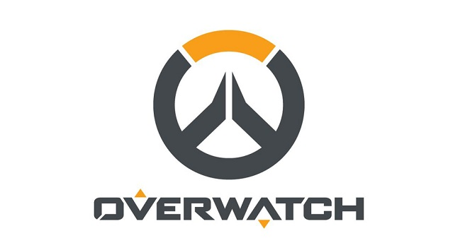

# Overwatch API Node Module
<p align=center></img></p>

[](https://www.npmjs.com/package/overwatch-api)
[](https://travis-ci.org/alfg/overwatch-api)

## Features
* Profile Data
* Career Stats
* Overwatch League Data
  * Live Match
  * Standings
  * Schedule

## Install
```
npm install --save overwatch-api
```

## Example
```javascript
const overwatch = require('overwatch-api');

const platform = 'pc';
const region = 'us';
const tag = 'Calvin-1337';

overwatch.getProfile(platform, region, tag, (err, json) => {
  if (err) console.error(err);
  else console.log(json);
});

```
```javascript
{ username: 'Calvin',
  level: 861,
  portrait: 'https://d1u1mce87gyfbn.cloudfront.net/game/unlocks/0x0250000000000EF7.png',
  games:
   { quickplay: { won: 647, played: undefined },
     competitive: { won: 15, lost: 12, draw: 0, played: 27 } },
  playtime: { quickplay: '129 hours', competitive: '5 hours' },
  competitive:
   { rank: 4416,
     rank_img: 'https://d1u1mce87gyfbn.cloudfront.net/game/rank-icons/season-2/rank-7.png' },
  levelFrame: 'https://d1u1mce87gyfbn.cloudfront.net/game/playerlevelrewards/0x0250000000000974_Border.png',
  star: 'https://d1u1mce87gyfbn.cloudfront.net/game/playerlevelrewards/0x0250000000000974_Rank.png' }
```

## API
```javascript
const overwatch = require('overwatch-api');
```

---

### Player Data

### overwatch.getProfile(platform, region, tag, callback)
`platform` - Platform of user. `pc, xbl, psn`

`region` - Region of player. `us, eu, kr, cn, global`

`tag` - BattleTag of user. Replace `#` with `-`.

`callback(err, data)` - Callback function which returns the error and response data.

### overwatch.getStats(platform, region, tag, callback)
`platform` - Platform of user. `pc, xbl, psn`

`region` - Region of player. `us, eu, kr, cn, global`

`tag` - BattleTag of user. Replace `#` with `-`.

`callback(err, data)` - Callback function which returns the error and response data.

---

### OWL Data

### overwatch.owl.getLiveMatch(callback)
`callback(err, data)` - Callback function which returns the error and response data.

### overwatch.owl.getStandings(callback)
`callback(err, data)` - Callback function which returns the error and response data.

### overwatch.owl.getSchedule(callback)
`callback(err, data)` - Callback function which returns the error and response data.


## License
MIT
